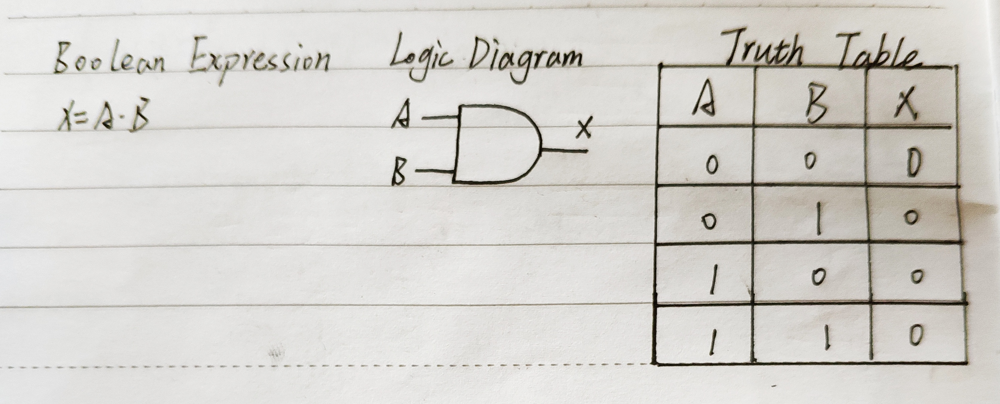
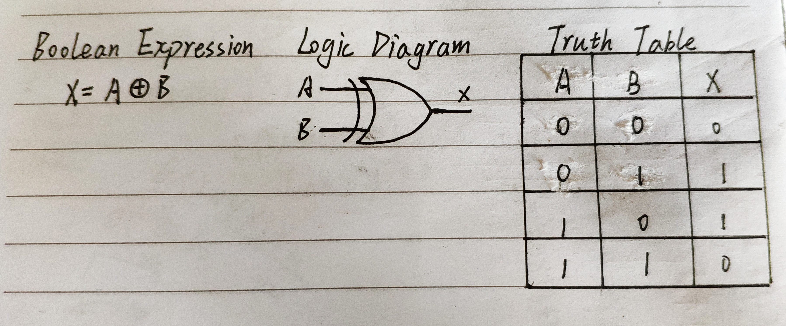
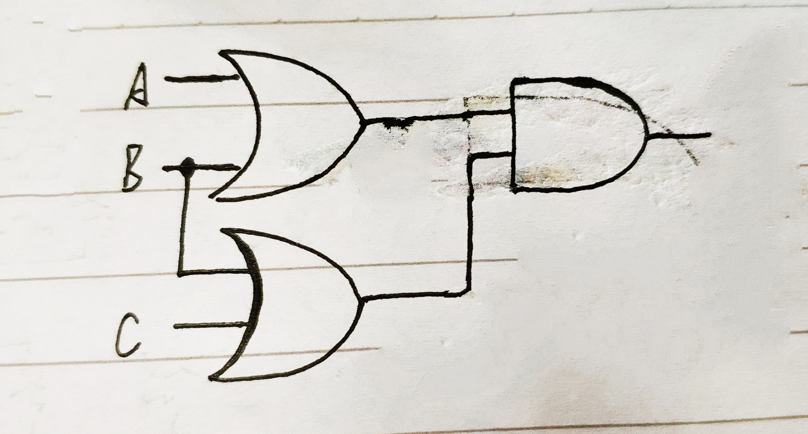
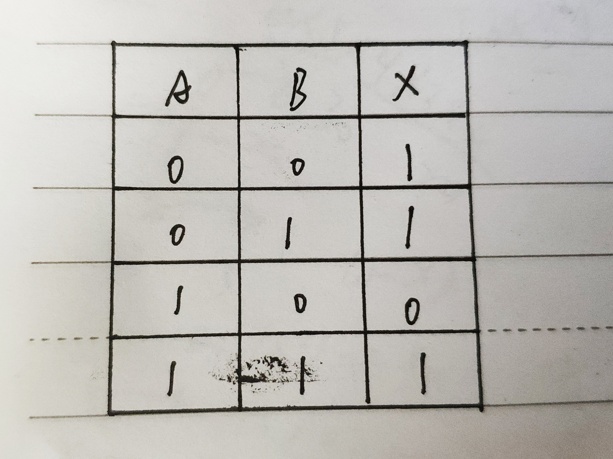
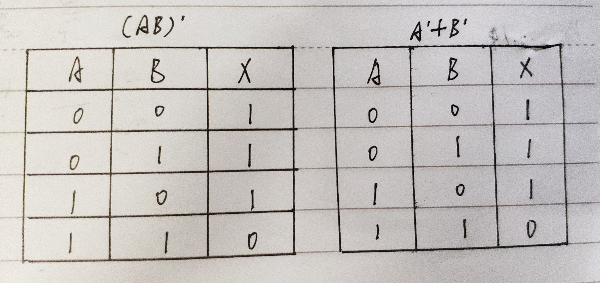
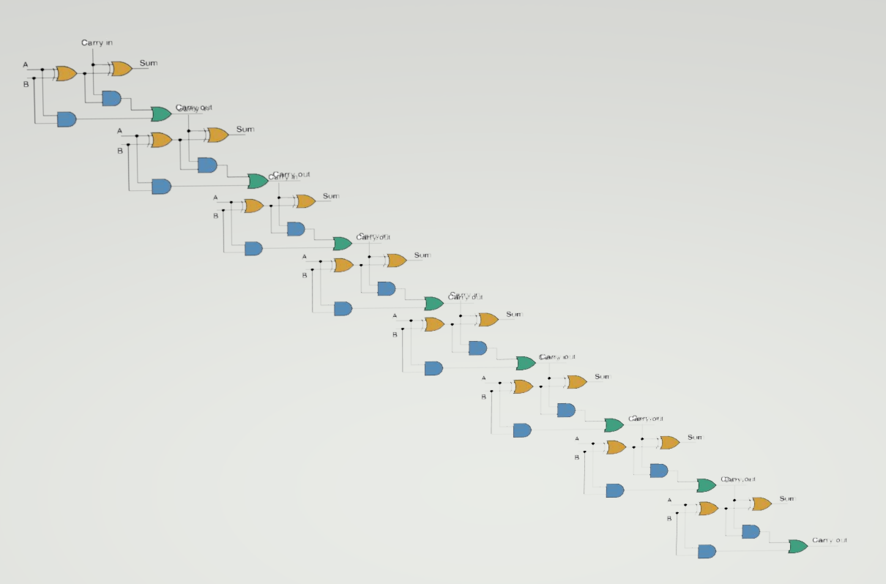

# 课后作业
(1)

两个都为1才是1

(2)

相同为0，不同为1

(3)

(4)

(5)

(6)

(7)

X8X7X6X5X4X3X2X1

X8X7X6X5X0000

00000000

# 解释概念
## Logic gate
In electronics, a logic gate is an idealized or physical device implementing a Boolean function; that is, it performs a logical operation on one or more binary inputs and produces a single binary output. Depending on the context, the term may refer to an ideal logic gate, one that has for instance zero rise time and unlimited fan-out, or it may refer to a non-ideal physical device (see Ideal and real op-amps for comparison).

Logic gates are primarily implemented using diodes or transistors acting as electronic switches, but can also be constructed using vacuum tubes, electromagnetic relays (relay logic), fluidic logic, pneumatic logic, optics, molecules, or even mechanical elements. With amplification, logic gates can be cascaded in the same way that Boolean functions can be composed, allowing the construction of a physical model of all of Boolean logic, and therefore, all of the algorithms and mathematics that can be described with Boolean logic.

在电子学中，逻辑门是实现布尔函数的理想化或物理设备; 也就是说，它对一个或多个二进制输入执行逻辑运算并产生单个二进制输出。根据上下文，该术语可以指理想的逻辑门，例如具有零上升时间和无限扇出的门，或者它可以指非理想的物理设备[1]（参见理想和实际操作）。放大器用于比较）。

逻辑门主要使用用作电子开关的二极管或晶体管来实现，但也可以使用真空管，电磁继电器（继电器逻辑），流体逻辑，气动逻辑，光学器件，分子或甚至机械元件来构造。通过放大，逻辑门可以与布尔函数组合的方式级联，允许构建所有布尔逻辑的物理模型，因此，所有的算法和数学 可以用布尔逻辑来描述。

---

## Boolean algebra
In mathematics and mathematical logic, Boolean algebra is the branch of algebra in which the values of the variables are the truth values true and false, usually denoted 1 and 0 respectively. Instead of elementary algebra where the values of the variables are numbers, and the prime operations are addition and multiplication, the main operations of Boolean algebra are the conjunction and denoted as ∧, the disjunction or denoted as ∨, and the negation not denoted as ¬. It is thus a formalism for describing logical relations in the same way that elementary algebra describes numeric relations.

在数学和数学逻辑，布尔代数是的分支代数，其中的值的变量是真值 真和假，通常分别表示为1和0。而不是初等代数，其中变量的值是数字，而素数运算是加法和乘法，布尔代数的主要操作是连词 ，表示为∧，分离 或表示为∨，而否定 不是表示为¬。因此，它描述逻辑关系的形式主义与初等代数描述数字关系的方式相同。

---
(1)触发器

(2)1