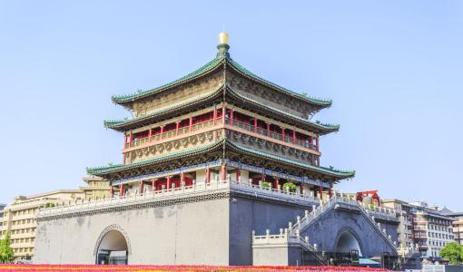

# **西安的前世今生**

## *前世--长安*

> ### 回头下望人寰处，不见长安见尘雾——《长恨歌》             

### **简介**          
长安是西安的古称，是历史上第一座被称为“京”的都城，也是历史上第一座真正意
义上的城市。汉高祖五年（前202年）置长安县，在渭河南岸、阿房宫北侧、秦兴乐
宫的基础上兴建长乐宫，高祖七年（前200年）营建未央宫，同年国都由栎阳迁移至
此，因地处长安乡，故名长安城，取意“长治久安”。长安是十三朝古都，是中国历
史上建都朝代最多，建都时间最长，影响力最大的都城，居中国四大古都之首，是
中华文明的发祥地，中华民族的摇篮，中华文化的杰出代表，隋唐时期世界最大的
城市。长安文化影响极其深远，由于建都长安的周、秦、汉、隋、唐是中国古代最
为强盛和文明的黄金时代，因此在唐以后，虽然长安不再为国都，但“长安”一词却
成为国都别称。今天首都北京最重要也最知名的神州第一街——长安街，就是以古长
安命名。

### **十三朝古都**          
西周、秦、西汉、新莽、东汉、西晋、前赵、前秦、后秦、西魏、北周、隋、唐

---

## *今生--西安*

> ### 我从西安古城走了，带走我的影子，却带不走你的怅惘————秋雨飘飘

+ ### **美食**
羊肉泡馍，凉皮，胡辣汤，biangbiang面，炸酱面，水盆羊肉，肉夹馍，冰峰，豆
腐脑，绿豆糕，酸梅汤，浆水鱼鱼，洋芋叉叉，水煎包，热米皮，岐山臊子面，户
县软面，炒拉条，黄焖鸡,烩三鲜

+ ### **旅游**
**钟楼**：  西安钟鼓楼是西安钟楼和西安鼓楼的合称，位于陕西省省会西安市市
中心，是西安的标志性建筑物，两座明代建筑遥相呼应，蔚为壮观。

**大雁塔**： 位于陕西省西安市雁塔区的大慈恩寺内，是一座7层方形佛塔。该塔
是西安市内著名古迹及标志性建筑，同时也是西安市市徽当中的主要组成部分。该
塔始建于唐朝永徽三年（652年），起初是玄奘为保存佛经而建造的塔，后曾因年久
失修和战乱而多次遭到损毁，至五代后唐年间才成为现在的造型。清朝康熙年间时
大雁塔开始出现倾斜，直至1996年时倾斜程度甚至达到1米左右，此后经过保护才有
所恢复。中华人民共和国成立后，大雁塔得到了专门保护。1963年，大雁塔被列为
全国重点文物保护单位，2013年时作为“丝绸之路：长安-天山廊道的路网”的组成
部分被列入世界文化遗产中。

