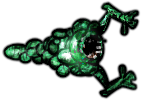

# **用construct2制做HTML5游戏**
## 安装construct2
[下载地址](https://www.scirra.com/manual/2/installing)

**注意**：Construct 2编辑器仅适用于
Windows，但您制作的游戏可以在任何地方
运行，例如Mac，Linux或iPad。免费版本
已足够初学者使用。

---

## 准备工作  
首先单击File,选择New,单击框底部的“Open”即可创建一个空白的空项目。

---

## 插入对象
### *平铺的背景*
用平铺背景对象可以制作出重复的背景图快，首先存下此图作为背景图

双击布局中的空格，出现插入新对象”对话框后，双击“平铺背景”对象将其插入

出现十字准星后，单击布局，出现纹理编辑器后，导入之前保存的背景图

单击右上角的X关闭纹理编辑器,确保选中它，然后左侧的属性栏应显示对象的所有设置，包括其大小和位置。将其位置设置为0,0（布局的左上角），并将其大小设置为1280,1024（布局的大小）。

### *添加图层*
单击“ 图层”选项卡，该选项卡通常位于“ 项目”栏旁边，单击绿色的“添加”图标为我们的其他对象添加新图层。并单击第零层旁边的小挂锁图标，它将被锁定。这意味着您将无法选择任何内容。这对我们的平铺背景非常方便。您的图层栏现在应该如下所示：

现在，确保在图层栏中选择了第一层，这很重要 - 所选图层是活动图层。所有新插入的对象都插入到活动层中。

### *添加对象*
将注意力转回布局。双击以插入另一个新对象。这次，选择Mouse对象，因为我们需要鼠标输入。对Keyboard对象再次执行相同操作。
接着存储下图

*Player*

*Bullet*

*Monster*

*Explode*

然后：
1. 双击以插入新对象
2. 双击 “Sprite”对象。
3.当鼠标变为十字准线时，单击布局中的某个位置。
4。弹出纹理编辑器。单击打开图标，然后加载四个纹理中的一个。
5. 关闭纹理编辑器，保存更改。

这些对象将被称为Sprite，Sprite2，
Sprite3和Sprite4。这样事情会混淆。根据
需要将它们重命名为Player，Monster，
Bullet和Explosion。选择对象，然后更改
属性栏中的Name属性即可。

---

## 添加行为
让我们来看看我们可以使用哪些行为。其中，Construct 2有这些行为;

- 8方向运动。这使您可以使用箭头键移动对象。
- 子弹运动。这只是以当前角度向前移动一个物体。它对玩家的子弹很有用。尽管有这个名字，它也可以很好地移动怪物 - 因为所有的移动都是以某种速度向前移动物体。
- 滚动到。这使得屏幕在移动时跟随对象（也称为滚动）。这对玩家有用。
- 绑定到布局。这将停止一个物体离开布局区域。这对玩家也很有用，所以他们不能在游戏区域外游荡！
- 破坏外部布局。而不是停止离开布局区域的对象，如果它停止，则会破坏它。它对我们的子弹很有用。没有它，子弹将永远飞离屏幕，总是占用一点内存和处理能力。相反，我们应该在他们离开布局后销毁子弹。
- 淡出。这逐渐使物体淡出，我们将用于爆炸。

为Player添加8方向移动行为。单击
播放器以选择它。在属性栏中，请注意“ 行
为”类别。单击“ 添加/编辑”。播放器的“行
为”对话框将打开。单击对话框中的绿色“添
加行为”图标。双击8方向移动以添加它。

再次执行相同操作，这次添加Scroll To行为，使屏幕跟随播放器，以及绑定到布局行为，以使它们保持在布局中。行为对话框现在应如下所示：

我们可以通过相同的方法向其他对象添加行为:
 
- 将Bullet移动和Destroy外部布局添加到Bullet对象（没有惊喜）
- 将子弹移动添加到Monster对象（因为它也向前移动）
- 将Fade行为添加到Explosion对象（因此它逐渐消失）出现后）。默认情况下，淡化行为也会在淡出淡出后破坏对象，这也使我们不必担心隐藏的爆炸对象会堵塞游戏。

接着在属性栏中将Monster速度从400更改为80。同样，将Bullet对象的速度更改为600，将Explosion对象的淡入淡出行为的淡出时间更改为0.5。

---

## 创造更多的怪物
按住控件，单击并拖动Monster对象来多创造几个怪物。注意不要放置太靠近玩家，否则他们可能会立即死亡！

---

## 活动
首先，单击顶部的“ 事件表1”选项卡以切换到“ 事件”表编辑器。事件从上到下运行，因此事件表顶部的事件首先运行。事件基本上如下所示：

是否符合所有条件？

---> 是：运行所有事件的动作。

---> 否：转到下一个事件

我们想让Player总是看着鼠标，双击事件表中的空格。这将提示我们为新事件添加条件。然后双击 System对象，该对话框将列出所有System对象的条件，双击every tick的条件，将其插入，对话框将关闭并创建事件。

现在我们要添加一个动作让Player一直看着鼠标。单击事件右侧的“Add action”链接,与添加事件一样，我们有相同的对象列表可供选择，但这次我们选择Player，双击 “ 设置角度朝向位置”操作。我们想要将角度设置为鼠标位置。输入Mouse.X为X，和Mouse.Y为Y。

最后单击参数对话框上的完成。它应该如下所示：

---

## 添加游戏功能
首先请记住，添加条件或操作的步骤如下：
- 双击以插入新事件，或单击“ 添加操作”链接以添加操作。
- 双击条件/操作所在的对象
- 双击所需的条件/操作。
- 输入参数（如果需要）。

### *1，让玩家开枪*
举办以下活动：

条件：鼠标 - > 单击 - >左键单击（默认值）

操作：Playeer - >生成另一个对象 - >对于对象，选择Bullet对象。对于Layer放1。将图像点保留为0。

活动现在应该如下所示：

### *2，子弹杀死怪物*
条件：子弹 - > 与另一个物体碰撞 - >选择怪物。

动作：怪物 - > 摧毁

动作：子弹 - >生成另一个对象 - > 爆炸，第1层

动作：子弹 - > 摧毁

### *3，爆炸效果*
由于爆炸时有巨大的黑色边框，我们单击右下角的对象栏中的Explosion对象，其属性显示在左侧的属性栏中。在底部，将其Blend mode属性设置为Additive。

### *4，使怪物变得更聪明*
现在，怪物只是偏离布局向右。让我们让它们变得更有趣。首先，让我们以随机的角度开始它们。

条件：系统 - > 开始布局

动作：怪物 - > 设置角度 - >随机（360）

当他们离开布局时，他们仍会永远徘徊，再也不会被人看到。让我们把它们留在里面。我们要做的是当他们离开布局时将他们指回玩家。

条件：怪物 - > 外部布局

动作：怪物 - > 设置角度朝向位置 - >对于X，Player.X - 对于Y，Player.Y。

现在事件列表应该是这样：

### *5,让怪物中弹五颗后再死亡*
实例变量允许每个怪物存储自己的健康值。
让我们为我们的怪物添加一个健康实例变量。单击项目栏或对象栏中的怪物，这将在属性栏中显示怪物的属性。点击添加/编辑来编辑变量。

在弹出的对话框中，键入health作为名称，将Type保留为Number，对于Initial value，输入5。当它们被击中时，我们将从健康状态中减去1，然后当健康状态为零时，我们将摧毁该物体。完成后，单击“确定”。请注意，变量现在出现在实例变量对话框中，也出现在怪物的属性中。

### *6,改变事件*
切换回活动表。现在，一旦子弹击中它们，我们就会摧毁怪物。让我们改变它从健康状况中减去1。

找到事件：Bullet - 与Monster碰撞。请注意，我们有一个“摧毁怪物”动作。让我们用“从健康中减去1”来代替它。右键单击“destroy monster”操作，然后单击“ replace”。出现相同的对话框，好像我们正在插入一个新动作，但这次它将取代我们点击的动作。

选择Monster - > Subtract from（在Instance variables category中）- > Instance变量“health”，并为Value输入1,单击完成。然后添加另一个事件：

条件：怪物 - >比较实例变量 - >健康，更少或相等，0 

动作：怪物 - >生成另一个对象 - >爆炸，第1层

动作：怪物 - >摧毁

如图所示

这样一个简单的射击游戏便完成了。

