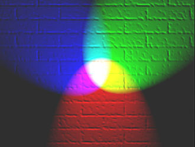
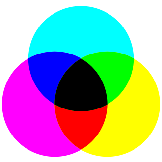

# 色彩表示与编码
## 引言
&emsp;&emsp;颜色是我们对到达视网膜的各种频率的光的感觉。人类视网膜有三种颜色感光视锥细胞，对应于红绿蓝三色，人类觉察的颜色均由三原色混合而成。

---

## 色彩表示法

### *1，RGB*
&emsp;&emsp;在计算机中，颜色通常用RGB（red，green，blue）值表示，这三个数字表明每种原色的相对份额。0表示这种颜色没有参与，255则表示这种颜色完全参与其中(三原色的红绿蓝不可能用其他单色光合成)。

表示颜色的数据量称为色深度。通常用表示该颜色的位数来表示色深度：

**增强彩色**：色深度为16位，RGB值中的每个数字由5位表示，最后一位有时用于表示透明度。

**真彩色**：色深度为24位，RGB值中的每个数字由8位表示，则每个数所属范围0-255。

&emsp;&emsp;RGB颜色模型的主要目的是在电子系统中检测，表示和显示图像，比如电视和计算机，但是在传统摄影中也有应用。在电子时代之前，基于人类对颜色的感知，RGB颜色模型已经有了坚实的理论支撑。

---

### *2,CMYK*
&emsp;&emsp;印刷四分色模式（CMYK）是彩色印刷时采用的一种套色模式，利用色料的三原色混色原理，加上黑色油墨，共计四种颜色混合叠加，形成所谓“全彩印刷”。四种标准颜色是：

C：Cyan ＝ 青色，常被误称为“天蓝色”或“湛蓝”

M：Magenta ＝ 洋红色，又称为“品红色”

Y：Yellow ＝ 黄色

K：blacK ＝ 黑色

&emsp;&emsp;虽然有文献解释说这里的K应该是Key Color（定位套版色），但其实是和制版时所用的定位套版观念混淆而有此一说。此处缩写使用最后一个字母K而非开头的B，是因为在整体色彩学中已经将B给了RGB的Blue蓝色。

&emsp;&emsp;洋红色加黄色会形成红色；洋红色加青色形成蓝色；青色加黄色形成绿色。理论上只用上述三种颜色相加就可以形成包含黑色在内101³共1,030,301色（0～100%模式），但实际印刷时，由于色料本身并非真正纯色，三色等量相加之后只能形成一种深灰色或深褐色，而非黑色；实际偏色程度依不同厂牌色料配方而有不同差异。

&emsp;&emsp;理想的CMY三原色油墨/墨水/彩色碳粉其印出成品的结果应该完全等同RGB三色光的补色，但目前现实世界里一般彩色印刷/喷墨/激光所使用的CMY三色色料不论何种厂牌实际上均有不同的色偏现象，一般“青色”均略带洋红而偏蓝，“洋红”一般同时带青与黄而偏紫，只有“黄色”仅略带微量洋红而略微偏橙；此外以三层CMY叠印产生黑色不仅不容易立即干燥、不利于快速印刷，三色叠印也需要非常精确的套印，用于表现有许多细小线条的文字十分不利；直接以黑色油墨替代不纯的CMY三层叠印所产生的不纯黑色，也可以大大节省成本。故此“黑色”虽非“原色”，却成为彩色印刷必备的色彩之一。

&emsp;&emsp;印刷和计算机显示屏显示，分属两种不同的色彩模式（计算机显示屏为发光体，遵循RGB“三原色光模式原理”；印刷为CMY+K油墨或墨水叠印、混色，遵循的是CMY“色料的三原色原理”），加上一般油墨印刷各原色网点色阶为0～100%，而计算机显示屏各原色光色阶为0～255，两者产生的色彩数差距甚大：CMYK仅有101³+101共1,030,402色，而RGB却有256³共16,777,216色；加上前述印刷油墨并非理想纯色，实际形成的色彩空间也小于RGB，使得不管哪一种RGB模式都超出CMYK的色域范围；故而印刷厂一般都会强调不能以显示屏上所看到的色彩要求输出成品的色差。

