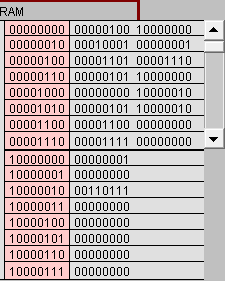

## 任务1
(2)点step after step。观察并回答下面问题：

1、PC：存放下一条指令的地址  IR：存放指令

2、accumulator.作用：常用于运算;在乘除等指令中指定用来存放操作数，另外,所有的I/O指令都使用这一寄存器与外界设备传送数据。

3、Fetch-Execute周期：从PC存储的指令地址0中获取新的指令“LOD #3”存入IR，通过Decoder解码后，将指令中的“3”载入累加器。

4、Fetch-Execute周期：从PC存储的指令地址8中获取新的指令“ADD　W”存入IR，通过Decoder解码后，将内存W中的数字3加到累加器中的数字7上，得到数字10。

5、“LOD #3”这条指令需要的数据包含在指令中，为立即寻址； “ADD W”这条指令需要的数据在内存W中，为直接寻址。

（3）点击“Binary”,观察回答下面问题

1、00010100 00000111

第一个字节为指令说明符，其中第一个1表示其寻址模式为立即寻址，后四位为操作码；第二个字节为操作数说明符，为二进制的7。

2、指令地址第一位为0；数据地址第一位为1。

3、8位

4、

int a = 3;

int b = 7;

int c = a + b;

---

## 任务2
(1)输入程序Program 2，运行并回答问题：

1、将3每次减去1直到减为0

2、for(int i = 3;i > 0 ;--i)

(2) 修改该程序，用机器语言实现 10+9+8+..1 ，输出结果存放于内存 Y

1、int m = 0;
	
    for(int i = 10;i > 0 ;--i)	{
		m = m + i;
	}

2、

3、区别：高级语言语句简略易懂，易修改；机器语言由二进制数字组成，繁琐复杂’

联系：高级语言会由编译器翻译成机器语言，一条高级语言对应于多条机器语言。