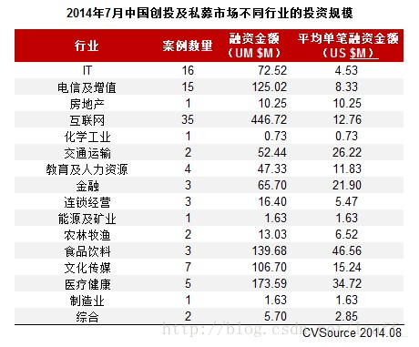

# IT风投之我见
**定义**：风险投资（英语：Venture Capital，缩写为VC）简称风投，又译称为创业投资，主要是指向初创企业提供资金支持并取得该公司股份的一种融资方式。风险投资是私人股权投资的一种形式。风险投资公司为一专业的投资公司，由一群具有科技及财务相关知识与经验的人所组合而成的，经由直接投资被投资公司股权的方式，提供资金给需要资金者（被投资公司）。风投公司的资金大多用于投资新创事业或是未上市柜企业（虽然现今法规上已大幅放宽资金用途），并不以经营被投资公司为目的，仅是提供资金及专业上的知识与经验，以协助被投资公司获取更大的利润为目的，所以是一追求长期利润的高风险高报酬事业。

&emsp;&emsp;由于风投的高风险性，选择一个合适的投资行业就变得至关重要。而被看好的行业所需要的四个要素是： 
1. 市场要非常大 
2. 要投的项目一定要有很快的成长速度 
3. 这个产品最好有很高的毛利润 
4. 门槛要高，类似的公司不是谁说能开就开的，也就是说没有太多的竞争

&emsp;&emsp;IT行业如今正呈上升态势，充满了机遇，以上四条可以说完全符合。因此IT行业越来越受企业家的追捧。从下图中也可以明显看出，IT与互联网的投资规模遥遥领先。

# 经典案例
## *阿里巴巴*
&emsp;&emsp;在1999年阿里巴巴成立后没多久它却遭遇了发展的瓶颈：公司账上没钱了。后来由于蔡崇信的关系马云得到了一笔“天使基金”——500万美元。

&emsp;&emsp;2000年，马云为阿里巴巴引进第二笔融资，2500万美元的投资来自软银、富达、汇亚资金、TDF、瑞典投资6家风险投资商，其中软银为2000万美元，阿里巴巴管理团队仍绝对控股。

&emsp;&emsp;2004年2月，阿里巴巴第三次融资，再从软银等风险投资商手中募集到8200万美元，其中软银出资6000万美元。马云及其创业团队仍然是阿里巴巴的第一大股东，占47%股份；第二大股东为软银，约占20%；富达约占18%；其他几家股东合计约15%。

&emsp;&emsp;软银在阿里巴巴上市当天账面上获得了巨额的回报。阿里巴巴招股说明书显示，软银持有阿里巴巴集团29.3%股份，而在行使完超额配售权之后，阿里巴巴集团还拥有阿里巴巴公司72.8%的控股权。由此推算，软银间接持有阿里巴巴21.33%的股份。到收盘时，阿里巴巴股价达到39.5港元。市值飙升至1980亿港元(约260亿美元)，软银间接持有的阿里巴巴股权价值55.45亿美元。若再加上2005年雅虎入股时曾套现1.8亿美元，软银当初投资阿里巴巴集团的8000万美元如今回报率已高达71倍，而这高风险也是最终给予了投资阿里的投资人极高的回报。

