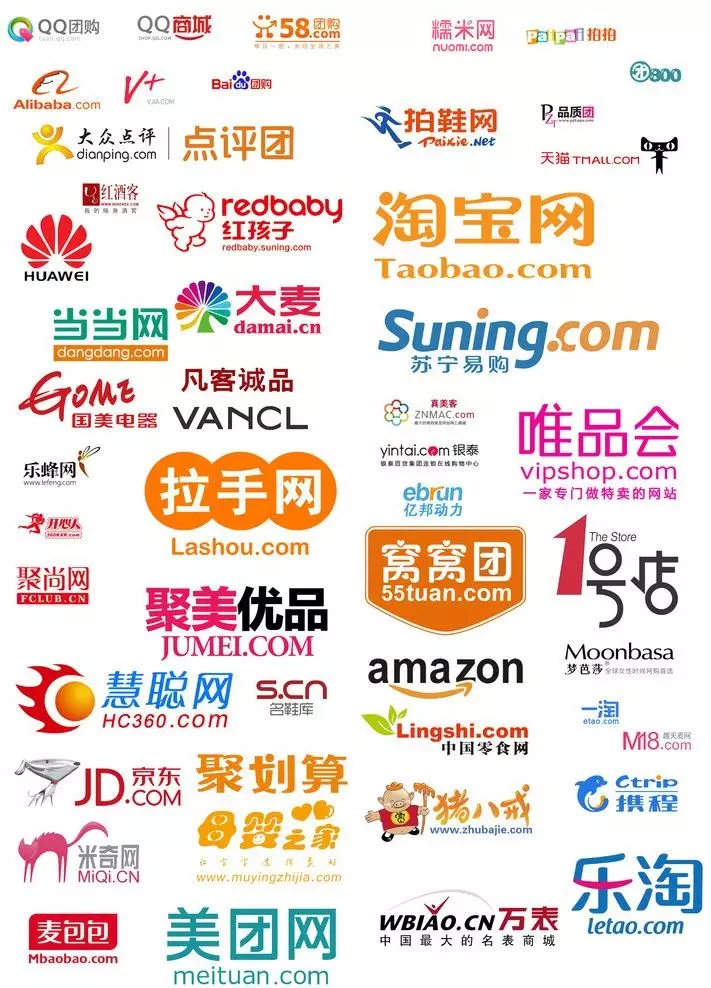
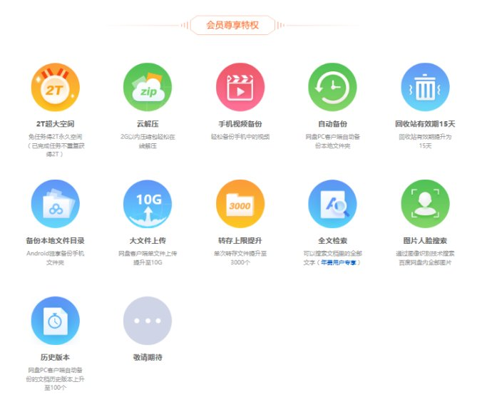

# 互联网时代的盈利模式与流量
> ### 流量聚集之处，金钱必将如影随形。
&emsp;&emsp;先来看看什么是流量：互联网流量可以简单的理解为用户访问数量，有了流量，就可以利用流量做转化，最终实现盈利目的。卖流量的方式很多，地铁，网页，微信公众号中投放的广告本质上都是在卖流量。有人认为，**互联网赚钱的本质就是流量**。

## 有了流量就有了市场
&emsp;&emsp;2015年，一个相貌平平的女子陆续在各大社交媒体发布自己精心制作的搞笑视频，仅仅用了半年时间就获得600万粉丝，2016年累计粉丝超过1300万，2016年3月获得真格基金等知名投行1200万投资，市场估值已超过上亿元。PAPI酱公众号首条贴片广告拍下2200万元的天价，类似的娱乐网红还有许多，例如MC天佑、陈翔六点半等；知识网红例如：逻辑思维、秋叶、咪蒙等等，更有众多的 90 后，他们都是抓住了流量，并利用了流量造就如今的身价。有的人不惜一切代价也要火，都是为了追求流量。

&emsp;&emsp;回顾腾讯的发展之路，一切的起源都是--QQ。腾讯坚持QQ的免费注册，几年下来积累了大量的用户，巨大的流量为其后来在多个领域的渗透提供了便利，铺平了道路。QQ音乐，QQ阅读，QQ浏览器，QQ游戏等等一系列产品的成功背后都有QQ所带来的流量的影子。

## 互联网的几大盈利模式
### 一、广告
&emsp;&emsp;互联网广告有其它形式的广告难以企及的巨大流量，因此倍受广告方亲睐。互联网产品通过提供廉价甚至免费的服务和平台基础去吸引用户的注入，当具有用户量和平台基础，即有了一定规模流量后就具有广告营销的价值，通过为广告主或第三方广告平台提供广告服务赢得丰厚收益。如视频软件播放视频前的广告插放等等。代表产品有百度，爱奇艺，网易等。

### 二、游戏
&emsp;&emsp;互联网游戏通过其趣味性吸引到巨大的流量。其具有三种盈利模式：

1. 下载游戏需要付费。如steam平台上的大多游戏。
2. 根据玩游戏的时长进行收费。如梦幻西游，魔兽世界。
3. 玩游戏免费，但有一些增值服务，如充值金币，购买皮肤等。此类模式在几乎所有游戏中都有应用。 

### 三、电商
&emsp;&emsp;电商平台给卖家提供一个集中的平台，用大额流量吸引卖家入驻，又通过其便利性和相比线下的优惠价格吸引买家，通过向卖家收取佣金以及商品推广等方式获利。

### 四、直播
&emsp;&emsp;直播是近年来的一个新兴产业。主播通过摄像头与观看直播的粉丝进行互动，粉丝可以给喜欢的主播送礼物，直播平台也会发给主播工资，同时直播平台会从主播的礼物中抽成。直播有很多分类，唱歌，舞蹈，游戏等等。大的主播拥有几千万粉丝的流量，收入惊人。

### 五、会员制
&emsp;&emsp;许多服务类产品通过基础功能的免费来吸引流量，同时向会员提供更加强力且全面的服务，通过会员制来盈利。如腾讯视频，QQ会员，百度云等。

