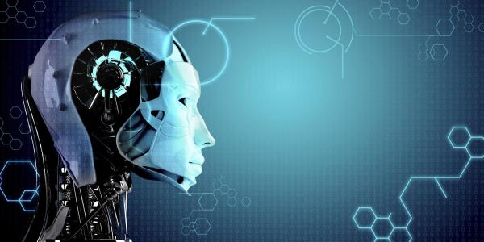
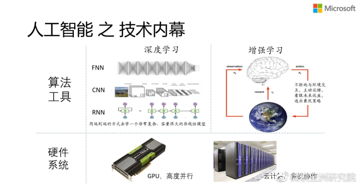
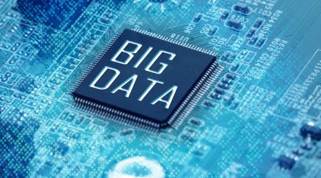

# 互联网时代的热点领域
&emsp;&emsp;随着科技的发展，计算机的性能突飞猛进，衍生出了许多新的领域。今天我们来谈谈互联网时代的**热点**领域
## 1、人工智能
&emsp;&emsp;**定义**：人工智能（Artificial Intelligence），英文缩写为AI。它是研究、开发用于模拟、延伸和扩展人的智能的理论、方法、技术及应用系统的一门新的技术科学。

&emsp;&emsp;让我们来看看近年来有哪些AI领域的大事件：

1. *AlphaGo打败世界第一棋手柯洁*&emsp;继2016年谷歌AlphaGo对战世界围棋冠军职业九段棋手李世石并赢得这场举世瞩目的“人机大战”后，2017年5月，升级版的AlphaGo Master与人类世界实时排名第一的棋手柯洁对决，最终连胜三局。
然而短短40天的时间后，更新一代的AlphaGo Zero以100：0的成绩完败前代AlphaGo版本。

2. *iPhone X人脸识别解锁*&emsp;今年9月苹果新品发布的最新产iPhone X，集合Face ID、无线充电、自创芯片A11 Bionic等最新AI技术嵌入。为了更加精准与安全地进行人脸识别，苹果甚至开发了一个AI神经引擎，用神经网络处理图像和点阵模式，并邀请好莱坞特效面具公司，通过制作面具来训练神经网络的“聪明”程度。

3. *AI应用取得医学新突破*&emsp;2017年年初“Nature”杂志消息，斯坦福大学的研究人员开发出了智能深度学习算法，通过大量训练发展出AI识别模式，使计算机学会分析图片并诊断疾病。
据称，其识别皮肤癌的准确率与专业的人类医生相当。配备这一深度神经网络的移动设备可以让皮肤科医生的诊断得到临床以外的使用

&emsp;&emsp;人工智能已经在语音、图像、自然语言等方面取得了长足的进步，并且在很多方面已经应用到了实际当中，比如喷洒农药，病理读片等。那么人工智能现象的背后是什么？说到技术层面，现在最火的两个词，一个叫**Deep Learning（深度学习）**，一个叫**Reinforcement Learning（增强学习）**。深度学习是什么？通俗地讲，它就是一个端到端的学习，我们不需要一些feature engineering，而是用一个非常复杂的、容量很大的模型去直接拟合输入输出，让模型自己探索有意义的中间表达。什么是增强学习？通俗地讲，就是学习机器不断地跟环境做自主的互动，在互动的过程中用长远的收益来指导当下该做什么决策，通过不断的跟环境互动去调整决策的最优性。

&emsp;&emsp;AI还在前进的路上，究竟能给我们的社会带来多少变化，让我们拭目以待。

## 2、大数据
> ### 大数据就是多，就是多。原来的设备存不下、算不动。————啪菠萝·毕加索
&emsp;&emsp;**定义**：大数据（big data），指无法在一定时间范围内用常规软件工具进行捕捉、管理和处理的数据集合，是需要新处理模式才能具有更强的决策力、洞察发现力和流程优化能力的海量、高增长率和多样化的信息资产。

&emsp;&emsp;大数据说白了就是海量的数据。对大数据的分析是一个量变引发质变的过程：看似没什么关联的数据，结合在一起却能看到其背后的内在规律，由此来帮助我们分析，预测。大数据已经应用在了医疗，能源，通信，甚至是广告行业。也许你在刚百度过洗头发的正确方法，浏览百度贴吧时就会给你推送治疗脱发的广告。这就是大数据的厉害之处，甚至对你投放什么广告都是用数据分析出来的，是你的“私人广告”。
&emsp;&emsp;而这又引发了人们对隐私问题的关注。我们日常生活中留下的种种数据，企业是否会拿来滥用呢？现如今，我们经常被**实名**，似乎互联网已经不再是现实的屏障，有心的企业通过你的外卖来查到你的个人信息似乎也不是什么难事。但在这一方面，法律法规也不够健全。法律只有跟着技术不断进步才能维护人们的安全。